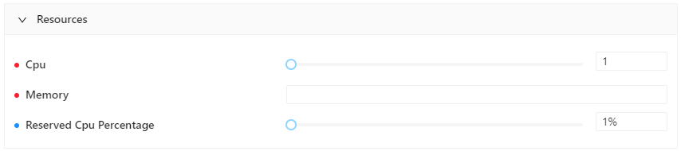
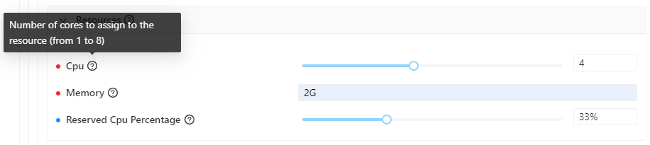
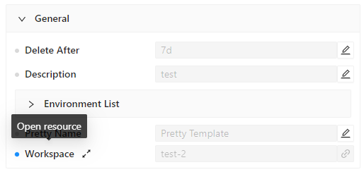
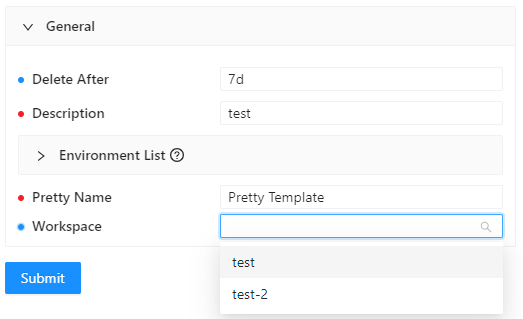

# How to write CRD that leverage the capabilities of the dashboard

Although the dashboard is object/agnostic, i.e. it can automatically show any object that is available in Kubernetes, the usability is greatly impacted by the way CRDs are created.

This document presents some suggestions about how to write CRDs in a way that facilitates the operations of the dashboard.

## Objects and fields description
The field `description` is a standard field in the OpenAPI v3.0 validation schema specifications and as a best practice
is suggested to add them to better describe an object field.
The dashboard leverages the presence of textual descriptions of a given field/object to show a tooltip that helps to 
understand what that object is about.

**Example of a CRD without field description**
```
...
resources:
  type: object
  required:
    - cpu
    - memory
  properties:
    cpu:
      type: integer
      maximum: 8
      minimum: 1
    memory:
      type: string
      pattern: ...
    reservedCpuPercentage:
      type: integer
      maximum: 100
      minimum: 1
...
```



**Example of an enriched CRD**

```
...
resources:
  description: The object that contains assigned resources
  type: object
  required:
    - cpu
    - memory
  properties:
    cpu:
      description: Number of cores to assign to the resource (from 1 to 8)
      type: integer
      maximum: 8
      minimum: 1
    memory:
      description: How much RAM (in units of M or G) to assign to the resource
      type: string
      pattern: ...
    reservedCpuPercentage:
      description: Percentage of CPU to reserve to the resource
      type: integer
      maximum: 100
      minimum: 1
...
```



**NOTE:** In the images above, we can see that each field is coupled with a blue or red dot. That is to help the user distinguish
whether a field is `required` or not. A `required` field is a field that **need** to be filled for the resource to be created
properly. If not, the resource will not be considered valid and as such it will not be created.

## Object reference
Often, a field of a given object is, in fact, a logical link to another object that already exist in Kubernetes.
Liqo*Dash* offers a custom method of describing this links directly in the CRD validation schema, that will be used to easily
navigate between related resources, and overall improve the user experience.

What we are about to describe is not a standard Kubernetes method, and is only used by the dashboard to help display
relationships between objects and facilitate the user in the creation, editing and exploration of resources.
This method requires a resource to reference another in a certain way that has to be specified in the validation
schema of the resource. So, in the schema of a CRD that references another resource, we have to create a field named as 
follows:
```
{REFERENCED_CRD_SINGULAR_NAME}.{REFERENCED_CRD_GROUP}/{REFERENCED_CRD_KIND}Ref
```

That is an object with two parameters:
- `name`: the name of the referenced resource
- `namespace`: the namespace in which the referenced resource resides (optional, if the referenced CRD is namespaced or not)

For example, if we want our CRD to reference another CRD, the yaml of the two resources should be something like this:

- Referenced CRD:
```
kind: CustomResourceDefinition
apiVersion: apiextensions.k8s.io/v1
metadata:
  name: workspaces.examplegroup.com
  ...  
spec:
  # This is the REFERENCED_CRD_GROUP
  group: examplegroup.com
  version: v1alpha1
  names:
    plural: workspaces
    # This is the REFERENCED_CRD_SINGULAR_NAME
    singular: workspace
    # This is the REFERENCED_CRD_KIND
    kind: Workspace
    listKind: WorkspaceList
...
```

- Referencing CRD:
```
...
workspace.examplegroup.com/WorkspaceRef:
  type: object
  required:
    - name
  properties:
    name:
      type: string
    namespace:
      type: string
...
```
**NOTE**: even if the referencing CRD contains a field `namespace` but the referenced CRD is not namespaced, that is not a problem and the parameter will simply be ignored.

With that, we have created a logical link to a resource of kind `Workspace`. We can see it graphically in the spec of the resource, as a field marked with a blue dot:



It is possible to navigate through linked resources simply by clicking on their field name, or open their spec in a pop up window for a quick look clicking the  icon.

Also, when creating a resource that contains a linked resource, the form wizard provides a simple way to specify the resource we want to link choosing from the resources available, making it sure that the user do not try to link a resource that does not exist.


